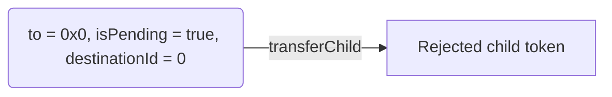
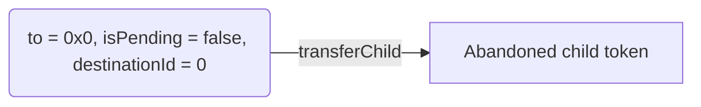
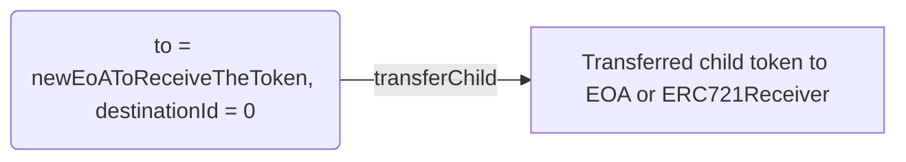
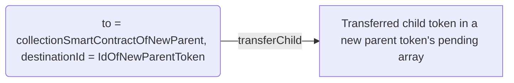

import { Tabs, Callout } from 'nextra/components'

# Child-management

Once you have deployed your Nestable NFT contract, you can dynamically change ownership of NFTs with the following operations.

## Writing operations

1. [Proposing a child.](#proposing-a-child)
    1. [Via `nestTransferFrom`.](#via-nest-transfer-from)
    2. [Via `_nestMint`.](#via-nest-mint)
2. [Accepting a child.](#accepting-a-child)
4. [Rejecting all children.](#rejecting-all-children)
3. [Transferring a child.](#transferring-a-child)
    1. [Rejecting a child.](#rejecting-a-child)
    2. [Abandoning a child.](#abandoning-a-child)
    3. [Unnesting child token to the root owner.](#unnesting-a-child)
    4. [Transferring the child token to an EOA or an `ERC721Receiver`.](#transferring-a-child-to-eoa)
    5. [Transferring the child token into a new parent token.](#transferring-a-child-to-parent)

### Proposing a child

IERC7401 follows as propose-accept pattern, to prevent malicious parties from spamming your NFTs. A child must be added via the `addChild` method defined in the standard, but this must only be called by the contract of the child NFT being added, since it needs to be aware that the child's owner will be the destination token.

Our core implementations include a `nestTransferFrom` method which can be called by the owner of the child NFT or an approved party. The alternative way to do it, is to directly mint the child into the parent. Our core implementations include an internal, non-opinionanted `_nestMint` method you can use to build on top, and our ready to use implementations include an external `nestMint` which has different behavior according to the type of implementation. Both of these will do the right `addChild` calls internally.

<Callout type="warning">
    Never call `addChild` directly on a Nestable contract, our implementations will revert in this case. Only the child contract is supposed to do this call.
</Callout>

`nestTransferFrom` and `_nestMint` have a `bytes` parameter: `data`, with no specified format. This parameter is passed to `addChild` so you can use it to pass arbitrary information to the parent contract. If you do not need it you can simply send empty bytes. You can also use the `data` parameter in the `_beforeNestedTokenTransfer` and `_afterNestedTokenTransfer` hooks. For more details see the [hooks]('../advanced-usage/hooks) section.

#### Via Nest Transfer From

You may add a `nestTransfer` on top of the `nestTransferFrom` method, which uses the `msg.sender` as the `from` (just as commonly `ERC721` implementations do). We did not include it to keep the ready to use implementations minimal in size so you have more space for custom logic.

<Tabs items={['Call', 'Definition', 'Child Emits', 'Parent Emits']}>
    <Tabs.Tab>
        ```typescript copy
        const childId = 10;
        const parentId = 1;
        const data = '0x';
        await childContract
            .nestTransferFrom(user.address, parentContract.address, childId, parentId, data);
        ```
    </Tabs.Tab>
    <Tabs.Tab>
        ```solidity
        /**
        * @notice Used to transfer the token into another token.
        * @param from Address of the direct owner of the token to be transferred
        * @param to Address of the receiving token's collection smart contract
        * @param tokenId ID of the token being transferred
        * @param destinationId ID of the token to receive the token being transferred
        * @param data Additional data with no specified format, sent in the addChild call
        */
        function nestTransferFrom(
            address from,
            address to,
            uint256 tokenId,
            uint256 destinationId,
            bytes memory data
        ) external;
        ```
    </Tabs.Tab>
    <Tabs.Tab>
        The child contract emits both `Transfer` and `NestTransfer`. `NestTransfer` has more complete information, but `Transfer` is emitted for backwards compatibility with `ERC721`. If you run an indexer, you can process only `NestTransfer` for contracts which implement `IERC7401`.
        ```solidity
        /**
        * @notice Used to notify listeners that the token is being transferred.
        * @dev Emitted when `tokenId` token is transferred from `from` to `to`.
        * @param from Address of the previous immediate owner, which is a smart contract if the token was nested.
        * @param to Address of the new immediate owner, which is a smart contract if the token is being nested.
        * @param fromTokenId ID of the previous parent token. If the token was not nested before, the value should be `0`
        * @param toTokenId ID of the new parent token. If the token is not being nested, the value should be `0`
        * @param tokenId ID of the token being transferred
        */
        event NestTransfer(
            address indexed from,
            address indexed to,
            uint256 fromTokenId,
            uint256 toTokenId,
            uint256 indexed tokenId
        );

        /**
        * @dev Emitted when `tokenId` token is transferred from `from` to `to`.
        */
        event Transfer(address indexed from, address indexed to, uint256 indexed tokenId);
        ```
    </Tabs.Tab>
    <Tabs.Tab>
        ```solidity
        /**
        * @notice Used to notify listeners that a new token has been added to a given token's pending children array.
        * @dev Emitted when a child NFT is added to a token's pending array.
        * @param tokenId ID of the token that received a new pending child token
        * @param childIndex Index of the proposed child token in the parent token's pending children array
        * @param childAddress Address of the proposed child token's collection smart contract
        * @param childId ID of the child token in the child token's collection smart contract
        */
        event ChildProposed(
            uint256 indexed tokenId,
            uint256 childIndex,
            address indexed childAddress,
            uint256 indexed childId
        );
        ```
    </Tabs.Tab>
</Tabs>


#### Via Nest Mint

<Tabs items={['Contract Call', 'Script Call', 'Definition', 'Child Emits', 'Parent Emits']}>
    <Tabs.Tab>
        Our ready to use implementations include a `nestMint` method which has different behavior according to the type of implementation. If you build your custom contract on top of our core or base implementations, you may implement your own `nestMint` method. The method is fully opinionanted and it is not mandatory, you can also have a regular `mint` and later do a [nest transfer](#via-nest-transfer-from).

        The `_prepareMint` method is available on the base implementations as a helper to assign next available `tokenIds`. For more details on the implementation levels see the [implementation section](../implementations). Here is an example of a bulk nest mint method:

        ```solidity copy
        function nestMint(
            address to,
            uint256 numToMint,
            uint256 destinationId
        ) public payable virtual returns (uint256 firstTokenId) {
            (uint256 nextToken, uint256 totalSupplyOffset) = _prepareMint(
                numToMint
            );
            _chargeMints(numToMint); // This depends on the charging method, and it is omitted on premint versions.

            for (uint256 i = nextToken; i < totalSupplyOffset; ) {
                // This method does not use the data parameter, but you can modify to your needs
                _nestMint(to, i, destinationId, "");
                unchecked {
                    ++i;
                }
            }

            return nextToken;
        }
        ```
    </Tabs.Tab>
    <Tabs.Tab>
        This script calls the implementation from the previous tab.
        ```typescript copy
        const numToMint = 10;
        const parentId = 1;
        const data = '0x';
        await childContract.nestMint(parentContract.address, numToMint, parentId);
        ```
    </Tabs.Tab>
    <Tabs.Tab>
        ```solidity
        /**
        * @notice Used to mint a child token to a given parent token.
        * @param to Address of the collection smart contract of the token into which to mint the child token
        * @param tokenId ID of the token to mint
        * @param destinationId ID of the token into which to mint the new child token
        * @param data Additional data with no specified format, sent in the addChild call
        */
        function _nestMint(
            address to,
            uint256 tokenId,
            uint256 destinationId,
            bytes memory data
        ) internal virtual;
        ```
    </Tabs.Tab>
    <Tabs.Tab>
        The child contract emits both `Transfer` and `NestTransfer` with address zero as `from`. `NestTransfer` has more complete information, but `Transfer` is emitted for backwards compatibility with `ERC721`. If you run an indexer, you can process only `NestTransfer` for contracts which implement `IERC7401`.
        ```solidity
        /**
        * @notice Used to notify listeners that the token is being transferred.
        * @dev Emitted when `tokenId` token is transferred from `from` to `to`.
        * @param from Address of the previous immediate owner, which is a smart contract if the token was nested.
        * @param to Address of the new immediate owner, which is a smart contract if the token is being nested.
        * @param fromTokenId ID of the previous parent token. If the token was not nested before, the value should be `0`
        * @param toTokenId ID of the new parent token. If the token is not being nested, the value should be `0`
        * @param tokenId ID of the token being transferred
        */
        event NestTransfer(
            address indexed from,
            address indexed to,
            uint256 fromTokenId,
            uint256 toTokenId,
            uint256 indexed tokenId
        );

        /**
        * @dev Emitted when `tokenId` token is transferred from `from` to `to`.
        */
        event Transfer(address indexed from, address indexed to, uint256 indexed tokenId);
        ```
    </Tabs.Tab>
    <Tabs.Tab>
        ```solidity
        /**
        * @notice Used to notify listeners that a new token has been added to a given token's pending children array.
        * @dev Emitted when a child NFT is added to a token's pending array.
        * @param tokenId ID of the token that received a new pending child token
        * @param childIndex Index of the proposed child token in the parent token's pending children array
        * @param childAddress Address of the proposed child token's collection smart contract
        * @param childId ID of the child token in the child token's collection smart contract
        */
        event ChildProposed(
            uint256 indexed tokenId,
            uint256 childIndex,
            address indexed childAddress,
            uint256 indexed childId
        );
        ```
    </Tabs.Tab>
</Tabs>

### Accepting a child

In order to become part of the array of active children, a proposed child must be accepted first. This should be done by either the owner of the parent token, or an approved party.

You may implement your own auto accept mechanism. The ready to use implementations by default auto accept the first asset, or assets added by the owner of the token. On [RMRK's wizard](https://wizard.rmrk.dev/), you can also create contracts with a method to define and auto-accept children from certain collections.

The `childIndex` parameter is an annoying detail, but it prevents the contract from having to do gas expensive operations, either:
* Iterate over the list of pending children to find the index.
* Keep track of the index for each child.

<Tabs items={['Script Call', 'Definition', 'Emits', 'Auto-accepting']}>
    <Tabs.Tab>
        ```typescript copy
        const parentId = 1;
        const childId = 10;
        // Find childIndex on parent's pending children
        const childrenIds = (await parentContract.pendingChildrenOf(parentId)).map(
            (child) => child.tokenId.toNumber()
        )
        const childIndex = childrenIds.indexOf(childId)
        await parentContract.acceptChild(parentId, childIndex, childContract.address, childId);
        ```
    </Tabs.Tab>
    <Tabs.Tab>
        ```solidity
        /**
        * @notice Used to accept a pending child token for a given parent token.
        * @dev This moves the child token from parent token's pending child tokens array into the active child tokens
        *  array.
        * @param parentId ID of the parent token for which the child token is being accepted
        * @param childIndex Index of a child tokem in the given parent's pending children array
        * @param childAddress Address of the collection smart contract of the child token expected to be located at the
        *  specified index of the given parent token's pending children array
        * @param childId ID of the child token expected to be located at the specified index of the given parent token's
        *  pending children array
        */
        function acceptChild(
            uint256 parentId,
            uint256 childIndex,
            address childAddress,
            uint256 childId
        ) external;
        ```
    </Tabs.Tab>
    <Tabs.Tab>
        ```solidity
        /**
        * @notice Used to notify listeners that a new child token was accepted by the parent token.
        * @dev Emitted when a parent token accepts a token from its pending array, migrating it to the active array.
        * @param tokenId ID of the token that accepted a new child token
        * @param childIndex Index of the newly accepted child token in the parent token's active children array
        * @param childAddress Address of the child token's collection smart contract
        * @param childId ID of the child token in the child token's collection smart contract
        */
        event ChildAccepted(
            uint256 indexed tokenId,
            uint256 childIndex,
            address indexed childAddress,
            uint256 indexed childId
        );
        ```
    </Tabs.Tab>
    <Tabs.Tab>
        This is an example of auto-accepting children through the `_afterAddAssetToToken` hook.

        ```solidity copy
        function _afterAddAssetToToken(
            uint256 tokenId,
            uint64 assetId,
            uint64 replacesAssetWithId
        ) internal virtual override {
            super._afterAddAssetToToken(tokenId, assetId, replacesAssetWithId);
            // This relies on no other auto accept mechanism being in place.
            // We auto accept the first ever asset or any asset added by the token owner.
            // This is done to allow a meta factory to mint, add assets and accept them in one transaction.
            if (
                _activeAssets[tokenId].length == 0 ||
                _msgSender() == ownerOf(tokenId)
            ) {
                _acceptAsset(tokenId, _pendingAssets[tokenId].length - 1, assetId);
            }
        }
        ```
    </Tabs.Tab>
</Tabs>

### Rejecting all children

Although there is a way to reject a child at a time, see [rejecting a child](#rejecting-a-child), at times you might want to remove all of your NFTs children. The method includes a `maxRejections` parameter, to prevent you from unwillingly rejecting a child which arrives just before the call is executed. You may set it to the total number of pending children and have the user confirm before doing the call.

<Tabs items={['Script Call', 'Definition', 'Emits']}>
    <Tabs.Tab>
        ```typescript copy
        const parentId = 1;
        const pendingChildren = await parentContract.pendingChildrenOf(parentId);
        const maxRejections = pendingChildren.length;
        // Confirm the number is what user expects.
        await parentContract.rejectAllChildren(parentId, maxRejections);
        ```
    </Tabs.Tab>
    <Tabs.Tab>
        ```solidity
        /**
        * @notice Used to reject all pending children of a given parent token.
        * @dev Removes the children from the pending array mapping.
        * @dev This does not update the ownership storage data on children. If necessary, ownership can be reclaimed by the
        *  rootOwner of the previous parent.
        * @dev Requirements:
        *
        * Requirements:
        *
        * - `parentId` must exist
        * @param parentId ID of the parent token for which to reject all of the pending tokens.
        * @param maxRejections Maximum number of expected children to reject, used to prevent from rejecting children which
        *  arrive just before this operation.
        */
        function rejectAllChildren(
            uint256 parentId,
            uint256 maxRejections
        ) external;
        ```
    </Tabs.Tab>
    <Tabs.Tab>
        ```solidity
        /**
        * @notice Used to notify listeners that all pending child tokens of a given token have been rejected.
        * @dev Emitted when a token removes all a child tokens from its pending array.
        * @param tokenId ID of the token that rejected all of the pending children
        */
        event AllChildrenRejected(uint256 indexed tokenId);
        ```
    </Tabs.Tab>
</Tabs>


### Transferring a child

There are 4 actions that can be achieved through the `transferChild` method. To fully understand them, we have to look at the available parameters passed to `transferChild`.

If the `to` parameter is address zero, which is the case of abandoning or rejecting a child, the parent contract does not call the child. This a safety measure to be able to remove malicious children without interacting with them.

If the `destinationId` is `0`, the destination must be an EOA or a contract implementing `IERC721Receiver`. In this case the parent contract will call `safeTransferFrom` on the child. On the other hand, if there is a destination token, the parent will call `nestTransferFrom` on the child.

In both cases the `data` parameter will be passed so you can use it to pass arbitrary information to the child contract. You may also use it on the `_beforeTransferChild` and `_afterTransferChild` hooks. For more details see the [hooks]('../advanced-usage/hooks) section.

The `childIndex` parameter is an annoying detail, but it prevents the contract from having to do gas expensive operations, either:
* Iterate over the list of pending children to find the index.
* Keep track of the index for each child.

<Tabs items={['Definition', 'Emits']}>
    <Tabs.Tab>
        ```solidity
        /**
        * @notice Used to transfer a child token from a given parent token.
        * @dev When transferring a child token, the owner of the token is set to `to`, or is not updated in the event of
        *  `to` being the `0x0` address.
        * @param tokenId ID of the parent token from which the child token is being transferred
        * @param to Address to which to transfer the token to
        * @param destinationId ID of the token to receive this child token (MUST be 0 if the destination is not a token)
        * @param childIndex Index of a token we are transferring, in the array it belongs to (can be either active array or
        *  pending array)
        * @param childAddress Address of the child token's collection smart contract.
        * @param childId ID of the child token in its own collection smart contract.
        * @param isPending A boolean value indicating whether the child token being transferred is in the pending array of
        *  the parent token (`true`) or in the active array (`false`)
        * @param data Additional data with no specified format, sent in call to `_to`
        */
        function transferChild(
            uint256 tokenId,
            address to,
            uint256 destinationId,
            uint256 childIndex,
            address childAddress,
            uint256 childId,
            bool isPending,
            bytes memory data
        ) external;
        ```
    </Tabs.Tab>
    <Tabs.Tab>
        This event is always emitted by the parent. The child is called when the destination address is not zero, in which case it would emit both `Transfer` and `NestTransfer`.  Abandoning or rejecting a child does not call the child so it will not emit any events.
        ```solidity
        event ChildTransferred(
            uint256 indexed tokenId,
            uint256 childIndex,
            address indexed childAddress,
            uint256 indexed childId,
            bool fromPending,
            bool toZero
        );
        ```
    </Tabs.Tab>
</Tabs>


Based on the desired state transitions, the values of these parameters have to be set accordingly (any parameters not set in the following examples depend on the child token being managed):

#### Rejecting a child

Removes a child from the pending children array of the parent token. For security reasons, the child token is never called.

<Callout>
    Abandoning and rejecting a child are very similar, the only difference is that child is that abandoning removes from active children, and rejecting from pending children.
</Callout>



```typescript
// These are example values, adjust depending on the tokens:
const tokenId = 1;
const childAddress = childContract.address;
const childId = 10;
// Find childIndex on parent's pending children
const childrenIds = (await parentContract.pendingChildrenOf(parentId)).map(
    (child) => child.tokenId.toNumber()
)
const childIndex = childrenIds.indexOf(childId)

// To reject
const to = ethers.constants.AddressZero;
const destinationId = 0;
const isPending = true;

// For custom usage
const data = '0x';

await parentContract
    .transferChild(tokenId, to, destinationId, childIndex, childAddress, childId, isPending, data);
```

#### Abandoning a child

Removes a child from the active children array of the parent token. For security reasons, the child token is never called.

<Callout>
    Abandoning and rejecting a child are very similar, the only difference is that child is that abandoning removes from active children, and rejecting from pending children.
</Callout>




```typescript copy
// These are example values, adjust depending on the tokens:
const tokenId = 1;
const childAddress = childContract.address;
const childId = 10;
// Find childIndex on parent's active children
const childrenIds = (await parentContract.childrenOf(parentId)).map(
    (child) => child.tokenId.toNumber()
)
const childIndex = childrenIds.indexOf(childId)

// To abandon
const to = ethers.constants.AddressZero;
const destinationId = 0;
const isPending = false;

// For custom usage
const data = '0x';

await parentContract
    .transferChild(tokenId, to, destinationId, childIndex, childAddress, childId, isPending, data);
```

#### Unnesting a child

Transfers the child token to an EOA or an `ERC721Receiver`. The EOA can be the root owner.



```typescript copy
// These are example values, adjust depending on the tokens:
const tokenId = 1;
const childAddress = childContract.address;
const childId = 10;
// Find childIndex on parent's actice children
const childrenIds = (await parentContract.childrenOf(parentId)).map(
    (child) => child.tokenId.toNumber()
)
const childIndex = childrenIds.indexOf(childId)
const isPending = false; // You can also transfer from pending

// To transfer to EOA or ERC721Receiver
const to = eoaOrErc721Receiver.address;
const destinationId = 0;

// For custom usage
const data = '0x';

await parentContract
    .transferChild(tokenId, to, destinationId, childIndex, childAddress, childId, isPending, data);
```

#### Transferring the child token into a new parent token [#transferring-a-child-to-parent]

Removes the child from the active children array on the current parent and adds it to the pending children array on the new one. The new parent's root owner can accept or reject it. Acceptance is needed even if the root owner of the new parent token is the same as the root owner of the former parent.



```typescript copy
// These are example values, adjust depending on the tokens:
const tokenId = 1;
const childAddress = childContract.address;
const childId = 10;
// Find childIndex on parent's actice children
const childrenIds = (await parentContract.childrenOf(parentId)).map(
    (child) => child.tokenId.toNumber()
)
const childIndex = childrenIds.indexOf(childId)
const isPending = false; // You can also transfer from pending

// To transfer to another NFT
const to = newParentContract.address;
const destinationId = 2;

// For custom usage
const data = '0x';

await parentContract
    .transferChild(tokenId, to, destinationId, childIndex, childAddress, childId, isPending, data);
```

## Reading operations

1. [Getting root owner](#getting-root-owner)
2. [Getting direct owner](#getting-direct-owner)
3. [Getting active children](#getting-active-children)
4. [Getting pending children](#getting-pending-children)

### Getting root owner

Used to retrieve the *root* owner of a given token. That is the owner of the token, or recursively the owner of the parent token if owner is an NFT. It will return an EOA or a contract implementing `IERC721Receiver`.

<Tabs items={['Call', 'Definition']}>
    <Tabs.Tab>
        ```typescript copy
        const tokenId = 1;
        const rootOwner = await parentContract.ownerOf(tokenId);
        // const rootOwner = '0x...'
        ```
    </Tabs.Tab>
    <Tabs.Tab>
        ```solidity
        /**
        * @notice Used to retrieve the *root* owner of a given token.
        * @dev The *root* owner of the token is an externally owned account (EOA). If the given token is child of another
        *  NFT, this will return an EOA address. Otherwise, if the token is owned by an EOA, this EOA will be returned.
        * @param tokenId ID of the token for which the *root* owner has been retrieved
        * @return owner The *root* owner of the token
        */
        function ownerOf(uint256 tokenId) external view returns (address owner);
        ```
    </Tabs.Tab>
</Tabs>

### Getting direct owner

Used to retrieve the immediate owner of the given token. It can be an EOA or a contract implementing either `IERC7401` or `IERC721Receiver`. If the owner is an NFT, the `parentId` will be non zero and `isNFT` will be `true`. If the owner is an EOA or or `IERC721Receiver`, the `parentId` will be `0` and `isNFT` will be `false`.

<Tabs items={['Call', 'Definition']}>
    <Tabs.Tab>
        ```typescript copy
        const tokenId = 1;
        const [owner, parentId, isNFT] = await parentContract.directOwnerOf(tokenId);
        // owner = '0x...'
        // parentId = 1
        // isNFT = true
        ```
    </Tabs.Tab>
    <Tabs.Tab>
        ```solidity
        /**
        * @notice Used to retrieve the immediate owner of the given token.
        * @dev If the immediate owner is another token, the address returned, should be the one of the parent token's
        *  collection smart contract.
        * @param tokenId ID of the token for which the RMRK owner is being retrieved
        * @return owner Address of the given token's owner
        * @return parentId The ID of the parent token. Should be `0` if the owner is an externally owned account
        * @return isNFT The boolean value signifying whether the owner is an NFT or not
        */
        function directOwnerOf(
            uint256 tokenId
        ) external view returns (address owner, uint256 parentId, bool isNFT);
        ```
    </Tabs.Tab>
</Tabs>

### Getting active children

Used to retrieve the active children tokens of a given parent token. The returned array consists of `Child` structs which contain `tokenId` and `contractAddress` of the child token. You can also retrieve a specific child given the index.

<Tabs items={['Call', 'Definition']}>
    <Tabs.Tab>
        ```typescript copy
        // All children
        const parentId = 1;
        const children = await parentContract.childrenOf(parentId);
        // children = [ 
        //     { tokenId: 10, contractAddress: '0x...' },
        //     { tokenId: 11, contractAddress: '0x...' },
        //     { tokenId: 12, contractAddress: '0x...' },
        // ]

        // A specific child
        const childIndex = 0;
        const child = await parentContract.childOf(parentId, childIndex);
        // child = { tokenId: 10, contractAddress: '0x...' }
        ```
    </Tabs.Tab>
    <Tabs.Tab>
        ```solidity
        /**
        * @notice Used to retrieve the active child tokens of a given parent token.
        * @dev Returns array of Child structs existing for parent token.
        * @dev The Child struct consists of the following values:
        *  [
        *      tokenId,
        *      contractAddress
        *  ]
        * @param parentId ID of the parent token for which to retrieve the active child tokens
        * @return children An array of Child structs containing the parent token's active child tokens
        */
        function childrenOf(
            uint256 parentId
        ) external view returns (Child[] memory children);

        /**
        * @notice Used to retrieve a specific active child token for a given parent token.
        * @dev Returns a single Child struct locating at `index` of parent token's active child tokens array.
        * @dev The Child struct consists of the following values:
        *  [
        *      tokenId,
        *      contractAddress
        *  ]
        * @param parentId ID of the parent token for which the child is being retrieved
        * @param index Index of the child token in the parent token's active child tokens array
        * @return child A Child struct containing data about the specified child
        */
        function childOf(
            uint256 parentId,
            uint256 index
        ) external view returns (Child memory child);
        ```
    </Tabs.Tab>
</Tabs>

### Getting pending children

Used to retrieve the pending children tokens of a given parent token. The returned array consists of `Child` structs which contain `tokenId` and `contractAddress` of the child token. You can also retrieve a specific child given the index.

<Tabs items={['Call', 'Definition']}>
    <Tabs.Tab>
        ```typescript copy
        // All children
        const parentId = 1;
        const children = await parentContract.pendingChildrenOf(parentId);
        // children = [
        //     { tokenId: 10, contractAddress: '0x...' },
        //     { tokenId: 11, contractAddress: '0x...' },
        //     { tokenId: 12, contractAddress: '0x...' },
        // ]

        // A specific child
        const childIndex = 0;
        const child = await parentContract.pendingChildOf(parentId, childIndex);
        // child = { tokenId: 10, contractAddress: '0x...' }
        ```
    </Tabs.Tab>
    <Tabs.Tab>
        ```solidity
        /**
        * @notice Used to retrieve the pending child tokens of a given parent token.
        * @dev Returns array of pending Child structs existing for given parent.
        * @dev The Child struct consists of the following values:
        *  [
        *      tokenId,
        *      contractAddress
        *  ]
        * @param parentId ID of the parent token for which to retrieve the pending child tokens
        * @return children An array of Child structs containing the parent token's pending child tokens
        */
        function pendingChildrenOf(
            uint256 parentId
        ) external view returns (Child[] memory children);
        
        /**
        * @notice Used to retrieve a specific pending child token from a given parent token.
        * @dev Returns a single Child struct locating at `index` of parent token's active child tokens array.
        * @dev The Child struct consists of the following values:
        *  [
        *      tokenId,
        *      contractAddress
        *  ]
        * @param parentId ID of the parent token for which the pending child token is being retrieved
        * @param index Index of the child token in the parent token's pending child tokens array
        * @return child A Child struct containting data about the specified child
        */
        function pendingChildOf(
            uint256 parentId,
            uint256 index
        ) external view returns (Child memory child);
        ```
    </Tabs.Tab>
</Tabs>
