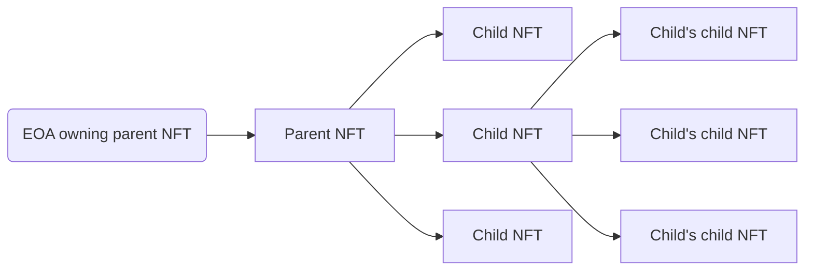

import { Callout } from 'nextra/components'
import Image from 'next/image'

# Nestable (ERC-7401)

<Image src="/images/modules/2-Nestable.png" alt="Nestable" width={500} height={500} />

The Nestable RMRK module allows for a new inter-NFT relationship and interaction.

At its core, the idea behind the module is simple: the owner of an NFT does not have to be an Externally Owned Account (EOA) or a smart contract, it can also be an NFT.

The process of nesting an NFT into another is functionally identical to sending it to another user. The process of sending a token out of another one involves issuing a transaction from the account owning the parent token.

An NFT can be owned by a single other NFT, but can in turn have a number of NFTs that it owns. This module provides the framework for the parent-child relationships of NFTs. A parent token is the one that owns another token. A child token is the token that is owned by another token. A token can be both a parent and child at the same time. Child tokens of a given tokens can be fully managed by the parent token's owner, but can be proposed by anyone.

The graph illustrates how a child token can also be a parent token, but both are still administered by the root parent token's owner.

<Callout type='info' emoji='⚙️'>
    Check implementations [here](/implementations#nestable)
</Callout>

## ERC-7401: Parent-Governed Non-Fungible Tokens Nesting

We published an Ethereum Improvement Proposal detailing the specification of the Nestable RMRK module. If you are interested, you can access it [here](https://eips.ethereum.org/EIPS/eip-7401).

