import { Steps, Callout, Tabs } from 'nextra/components'

# Multi-Asset Journey ( Part 2, Cookbook )

#### User journey context 

_Expert chefs Master and his student Alice are traveling the world to develop unique recipes. Their goal is to create a renowned cookbook showcasing their culinary innovations._


{/* Every action will be performed with smart contract functions with the help of some Typescript code. */}

<Steps>

### Minting NFTs

_After starting their travels, Master and Alice decided to separate and they had taken two separate different paths. Master **crafted** his cookbook in Japan, ancient place rich with tradition and history._

<Callout type="info">
    We provide valid IPFS URI throughout all of steps, feel free to use them, they point to a JSON file with the corresponding metadata for the step.
</Callout>

<Tabs items={['Remix', 'Hardhat' ]}> 
    <Tabs.Tab>
        While connected to the Master's account, go under deployed contracts and search for the `mint` method. Expand it and fill the data.
        - `to`: Master's address
        - `numToMint`: 1
        - `tokenURI`: `ipfs://QmWcoQ7MvDRVCBZ2Xii3TtNYThdoibztG1gkutDHyS6KQk/masters-cookbook.json`
        Your input should look like this, then click on the transact button.
        
    </Tabs.Tab>
    <Tabs.Tab>
        On your `journey.ts` script, under the `// Journey starts here:` line, add the following code.
        ```typescript copy
        // 1. Minting NFTs
        // The ipfs URI points to a JSON file that contains the metadata for the NFT.
        let tx = await cookbook
            .connect(master)
            .mint(
            master.address,
            1,
            'ipfs://QmWcoQ7MvDRVCBZ2Xii3TtNYThdoibztG1gkutDHyS6KQk/masters-cookbook.json',
            );
        await tx.wait();
        console.log(`Minted token with id 1 for ${master.address}`);
        ```
        <Callout type="info">
            We will run the journey only at the end, so we do not need to comment past steps or add multiple scripts.
        </Callout>
    </Tabs.Tab>
</Tabs>

Our Master wallet now contains a new NFT from the cookbook collection. Token Ids are assigned sequentially on the ready to use implementations, so we have a token with ID 1 being the master's cookbook.

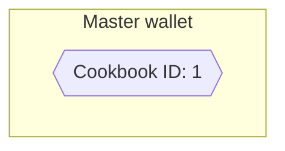

### Recipes creation - Adding assets to the collection

_During his stay Master studied a lot and after getting the inspiration he **gave life** to 3 raw recipes._

You can use these 3 IPFS URIs for the metadata:
- `ipfs://QmQSoP7iT9C7PdNPvoxhKSvXq3Bkpxnz9AC6N7GCoJDNVt/1-carbonara.json`
- `ipfs://QmQSoP7iT9C7PdNPvoxhKSvXq3Bkpxnz9AC6N7GCoJDNVt/2-cesar-salad.json`
- `ipfs://QmQSoP7iT9C7PdNPvoxhKSvXq3Bkpxnz9AC6N7GCoJDNVt/3-grilled-salmon.json`

<Tabs items={['Remix', 'Hardhat' ]}> 
    <Tabs.Tab>
        While connected to the Master's account, go under deployed contracts and search for the `addAssetEntry` method. Expand it and for each of the 3 given assets, set it and hit transact.
        
        Your input should look like this:
        
    </Tabs.Tab>
    <Tabs.Tab>
        On your `journey.ts` script, let's add the code to add the 3 assets to the collection.
        ```typescript copy
        // 2. Recipes creation - Adding assets to the collection
        const assets = [
            'ipfs://QmQSoP7iT9C7PdNPvoxhKSvXq3Bkpxnz9AC6N7GCoJDNVt/1-carbonara.json',
            'ipfs://QmQSoP7iT9C7PdNPvoxhKSvXq3Bkpxnz9AC6N7GCoJDNVt/2-cesar-salad.json',
            'ipfs://QmQSoP7iT9C7PdNPvoxhKSvXq3Bkpxnz9AC6N7GCoJDNVt/3-grilled-salmon.json',
        ];
        for (const asset of assets) {
            tx = await cookbook.connect(master).addAssetEntry(asset);
            await tx.wait();
        }
        console.log(`Added ${assets.length} assets to the collection`);
        ```
        <Callout type="info">
            We will run the journey only at the end, so we do not need to comment past steps or add multiple scripts.
        </Callout>
    </Tabs.Tab>
</Tabs>

The collection now contains 3 assets, but they are not bound to any token yet. Asset Ids are assigned sequentially on the ready to use implementations, so we have assets with IDs 1, 2 and 3.

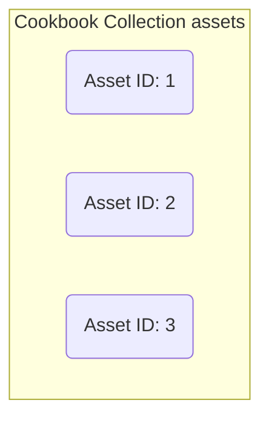


### Recipes creation - Adding assets to a token

Now Master will add the 3 recipes (assets) to his cookbook.

<Tabs items={['Remix', 'Hardhat' ]}> 
    <Tabs.Tab>
        While connected to the Master's account, go under deployed contracts and search for the `addAssetToToken` method. Expand it and for each of the 3 given assets, set it and hit transact. Remember we have asset ids from 1 to 3 and master's cookbook has token id 1.
        
        Your input should look like this:
        
    </Tabs.Tab>
    <Tabs.Tab>
        On your `journey.ts` script, let's add the code to add the 3 assets to the master's cookbook.
        ```typescript copy
        // 3. Recipes creation - Adding assets to a token
        const assetIds = [1, 2, 3];
        const masterCookbookId = 1;
        for (const assetId of assetIds) {
            tx = await cookbook.connect(master).addAssetToToken(masterCookbookId, assetId, 0);
            await tx.wait();
        }
        console.log(`Added ${assetIds.length} assets to the token ${masterCookbookId}`);
        ```
        <Callout type="info">
            We will run the journey only at the end, so we do not need to comment past steps or add multiple scripts.
        </Callout>
    </Tabs.Tab>
</Tabs>

In general, Master would need to accept each of those assets, but our implementation has an autoaccept mechanism that will accept the asset if the owner of the token is the same user adding the token. So we can skip the accept step, the token now has 3 assets bound to it.


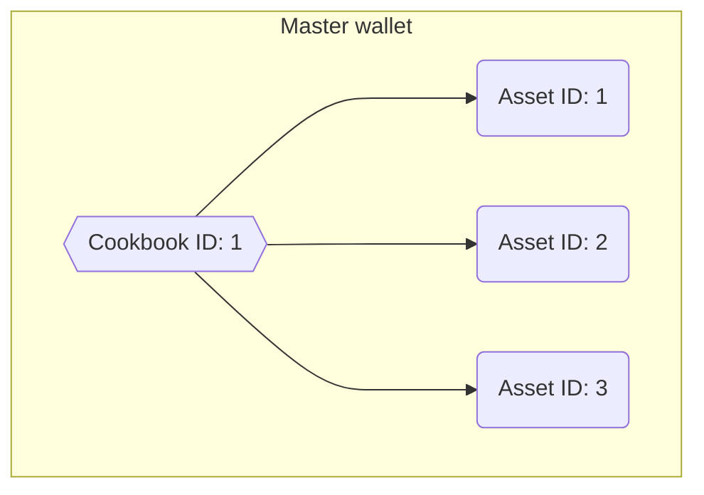

### Managing Contributors

_Alice was eager to create her own cookbook, yet she understood that crafting recognizable recipes was a privilege not afforded to everyone—it was an exclusive endeavor. Therefore, she approached Master to request permission to contribute to this significant project, and happily, he agreed._

Our ready to use Pre-Mint implementations, allow for the owner or a contributor to mint tokens, add new assets and add assets to tokens. So we will add Alice as a contributor to the collection. We need to do this as Master account, since only the owner of the collection has permissions to add or remove contributors.

<Tabs items={['Remix', 'Hardhat' ]}> 
    <Tabs.Tab>
        While connected to the Master's account, go under deployed contracts and search for the `manageContributor` method. Expand it, fill the inputs and hit transact.
        - `contributor`: Alice's address
        - `grantRole`: `true`
        - `tokenURI`: `ipfs://QmWcoQ7MvDRVCBZ2Xii3TtNYThdoibztG1gkutDHyS6KQk/masters-cookbook.json`
        
        Your input should look like this:
        
    </Tabs.Tab>
    <Tabs.Tab>
        On your `journey.ts` script, let's add the code to add Alice as a contributor. Make sure to update Alice's address with the one you are using.
        ```typescript copy
        // 4. Managing Contributors
        tx = await cookbook.connect(master).manageContributor(alice.address, true);
        await tx.wait();
        console.log(`Added ${alice.address} as a contributor`);

        ```
        <Callout type="info">
            We will run the journey only at the end, so we do not need to comment past steps or add multiple scripts.
        </Callout>
    </Tabs.Tab>
</Tabs>

### Alice Creates her cookbook - Minting a new token and adding assets to it

Now we will interact using Alice's account. She will create her own cookbook and add some recipes to it. 

You can use these 2 IPFS URIs for the metadata:
- `ipfs://QmQSoP7iT9C7PdNPvoxhKSvXq3Bkpxnz9AC6N7GCoJDNVt/4-stir-fry.json`
- `ipfs://QmQSoP7iT9C7PdNPvoxhKSvXq3Bkpxnz9AC6N7GCoJDNVt/5-chocolate-cake.json`

<Tabs items={['Remix', 'Hardhat' ]}> 
    <Tabs.Tab>
        Change to Alices's account in your wallet and repeat the steps we did with Master.
        1. Mint.
        - `to`: Alices's address
        - `numToMint`: 1
        - `tokenURI`: `ipfs://QmWcoQ7MvDRVCBZ2Xii3TtNYThdoibztG1gkutDHyS6KQk/alices-cookbook.json`
        
        2. Add assets to the collection (they will have ids 4 and 5)
        
        3. Add assets to the token (her cookbook, token id 2)
        
    </Tabs.Tab>
    <Tabs.Tab>
        In your `journey.ts` script, let's have Alice add new assets and then add them to her cookbook.
        ```typescript copy
        // 5. Alice Creates her cookbook - Minting a new token and adding assets to it
        const assetsByAlice = [
            'ipfs://QmQSoP7iT9C7PdNPvoxhKSvXq3Bkpxnz9AC6N7GCoJDNVt/4-stir-fry.json',
            'ipfs://QmQSoP7iT9C7PdNPvoxhKSvXq3Bkpxnz9AC6N7GCoJDNVt/5-chocolate-cake.json',
        ];
        tx = await cookbook
            .connect(alice)
            .mint(
            alice.address,
            1,
            'ipfs://QmWcoQ7MvDRVCBZ2Xii3TtNYThdoibztG1gkutDHyS6KQk/alices-cookbook.json',
            );
        await tx.wait();
        for (const asset of assetsByAlice) {
            tx = await cookbook.connect(alice).addAssetEntry(asset);
            await tx.wait();
        }
        const alicesCookbookId = 2;
        const assetIdsByAlice = [4, 5];
        for (const assetId of assetIdsByAlice) {
            tx = await cookbook.connect(alice).addAssetToToken(alicesCookbookId, assetId, 0);
            await tx.wait();
        }
        console.log(`Added ${assetsByAlice.length} assets to the token ${alicesCookbookId}`);
        ```
        <Callout type="info">
            We will run the journey only at the end, so we do not need to comment past steps or add multiple scripts.
        </Callout>
    </Tabs.Tab>
</Tabs>

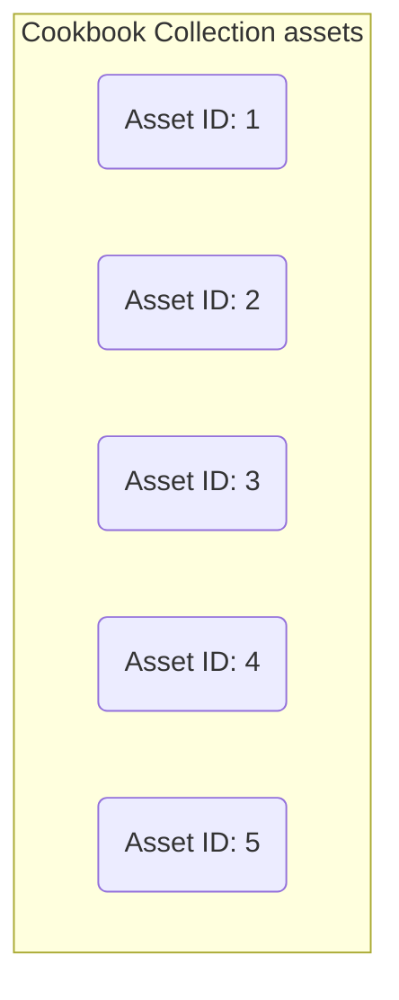
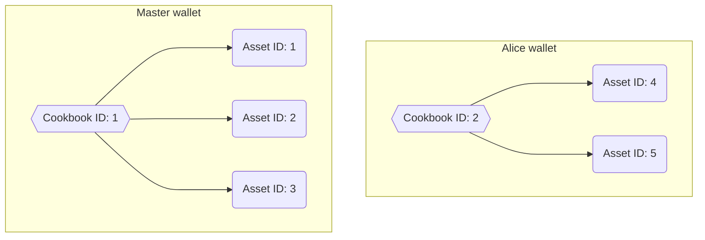

### Collaboration - Accepting assets proposed by others

_During his travel, Master created a recipe dedicated to his student and he decided to **send** it to Alice, to add it to her cookbook. Alice **accepted** the recipe gifted from her master..._

<Tabs items={['Remix', 'Hardhat' ]}> 
    <Tabs.Tab>
        Change to Master's account in your wallet and then:
        1. Add asset entry, metadata URI: `ipfs://QmQSoP7iT9C7PdNPvoxhKSvXq3Bkpxnz9AC6N7GCoJDNVt/6-chicken-tikka.json`.
        
        2. Add the asset to Alice's cookbook (The asset has Id 6, Alice's cookbook has Id 2).
        
        3. Change to Alice's account and accept it. It is at index 0 since there are no more pending assets.
        
    </Tabs.Tab>
    <Tabs.Tab>
        On your `journey.ts` script, let's have Master add a new asset and add it to Alice's cookbook. Then let's have Alice accept it.
        ```typescript copy
        // 6. Collaboration - Accepting assets proposed by others
        tx = await cookbook
            .connect(master)
            .addAssetEntry('ipfs://QmQSoP7iT9C7PdNPvoxhKSvXq3Bkpxnz9AC6N7GCoJDNVt/6-chicken-tikka.json');
        await tx.wait();
        const masterToAliceAssetId = 6;
        tx = await cookbook.connect(master).addAssetToToken(alicesCookbookId, masterToAliceAssetId, 0);
        await tx.wait();
        tx = await cookbook.connect(alice).acceptAsset(alicesCookbookId, 0, masterToAliceAssetId);
        await tx.wait();
        console.log(`Accepted asset ${masterToAliceAssetId} from ${master.address}`);
        ```
        <Callout type="info">
            We will run the journey only at the end, so we do not need to comment past steps or add multiple scripts.
        </Callout>
    </Tabs.Tab>
</Tabs>

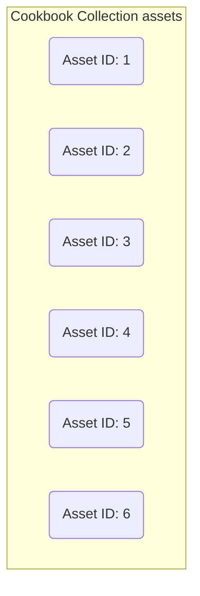
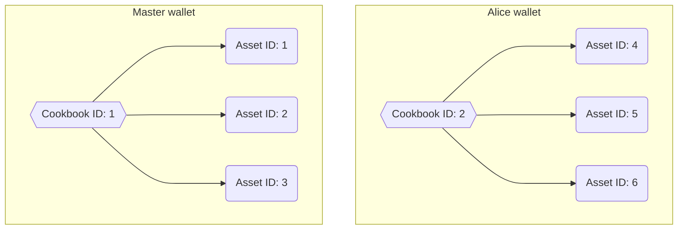

### Alice improves recipe - Asset replacement

_Alice felt that the recipe was missing something. After a long search and many attempts she found the right missing ingredient. So Alice fixed the recipe and she replaced the old one with this new, improved one._

The asset is auto accepted since the user (Alice) adding it, owns the token.

<Tabs items={['Remix', 'Hardhat' ]}> 
    <Tabs.Tab>
        Using to Alices's account in your:
        1. Add asset entry, metadata URI: `ipfs://QmSMs4nsW5LMKHbE4bqjCDQbwfSs6FKFPzkJWXFYtvuvjh`.
        
        2. Add the asset to Alice's cookbook (The new asset has Id 7, the old one has Id 6, Alice's cookbook has Id 2).
        
    </Tabs.Tab>
    <Tabs.Tab>
        On your `journey.ts` script, let's have Alice add a new asset and add it to her cookbook, replacing the asset from her Master. 
        ```typescript copy
        // 7. Alice improves recipe - Asset replacement
        tx = await cookbook
            .connect(alice)
            .addAssetEntry('ipfs://QmSMs4nsW5LMKHbE4bqjCDQbwfSs6FKFPzkJWXFYtvuvjh');
        await tx.wait();
        const improvedAssetId = 7;
        tx = await cookbook
            .connect(alice)
            .addAssetToToken(alicesCookbookId, improvedAssetId, masterToAliceAssetId);
        await tx.wait();
        // Asset is auto accepted
        console.log(`Improved asset ${masterToAliceAssetId} with ${improvedAssetId}`);
        ```
        <Callout type="info">
            We will run the journey only at the end, so we do not need to comment past steps or add multiple scripts.
        </Callout>
    </Tabs.Tab>
</Tabs>

<Callout>
    It's important to note that the earlier asset (with Id 6), is still in the collection, but it is not bound to any token. The owner or a contributor could reuse it into any token in the future.
</Callout>

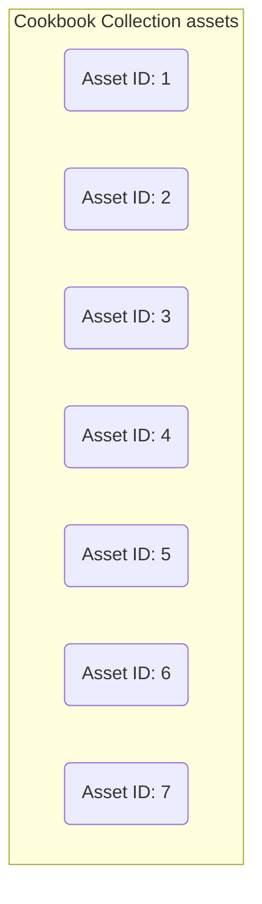


### Master and Alice collaboration - Proposing assets to a token

_After this fix, Alice's career took flight and Master, proud of his student, proposed to create 2 recipes as a collaboration to add her cookbook. The last recipe was so delicious that Master added it to his cookbook as well!_

You can use these 2 IPFS URIs for the metadata:
- `ipfs://QmQSoP7iT9C7PdNPvoxhKSvXq3Bkpxnz9AC6N7GCoJDNVt/8-buddha-bowl.json`
- `ipfs://QmQSoP7iT9C7PdNPvoxhKSvXq3Bkpxnz9AC6N7GCoJDNVt/9-shrimp-scamp-pasta.json`

<Tabs items={['Remix', 'Hardhat' ]}> 
    <Tabs.Tab>
        Change to Master's account in your wallet and then:
        1. Add both assets to the collection (they will have Ids 8 and 9).
        2. Add both assets to the token (Alice's cookbook, token Id 2).
        3. Add the LAST asset to Master's cookbook (token Id 1, asset Id 9).
        4. Change to Alice's account and accept them. Initially asset Id 8 will be at index 0, after accepting it now asset Id 9 will also have index 0.
    </Tabs.Tab>
    <Tabs.Tab>
        On your `journey.ts` script, let's have Master add new assets and then add them to Alice's and his own cookbook.
        ```typescript copy
        // 8. Master and Alice collaboration - Proposing assets to a token
        const assetsByMasterToAlice = [
            'ipfs://QmQSoP7iT9C7PdNPvoxhKSvXq3Bkpxnz9AC6N7GCoJDNVt/8-buddha-bowl.json`',
            'ipfs://QmQSoP7iT9C7PdNPvoxhKSvXq3Bkpxnz9AC6N7GCoJDNVt/9-shrimp-scamp-pasta.json',
        ];
        // Master adds the assets
        for (const asset of assetsByMasterToAlice) {
            tx = await cookbook.connect(master).addAssetEntry(asset);
            await tx.wait();
        }
        // Master adds the assets to Alice's cookbook
        const assetIdsByMasterToAlice = [8, 9];
        for (const assetId of assetIdsByMasterToAlice) {
            let tx = await cookbook.connect(master).addAssetToToken(alicesCookbookId, assetId, 0);
            await tx.wait();
        }
        // Master adds the first recipe to his cookbook
        tx = await cookbook
            .connect(master)
            .addAssetToToken(masterCookbookId, assetIdsByMasterToAlice[1], 0);
        await tx.wait();
        // Alice accepts the assets
        for (const assetId of assetIdsByMasterToAlice) {
            tx = await cookbook.connect(alice).acceptAsset(alicesCookbookId, 0, assetId);
            await tx.wait();
        }
        console.log(
            `Added ${assetIdsByMasterToAlice.length} assets to the token ${alicesCookbookId} and 1 to ${masterCookbookId}`,
        );

        ```
        <Callout type="info">
            We will run the journey only at the end, so we do not need to comment past steps or add multiple scripts.
        </Callout>
    </Tabs.Tab>
</Tabs>

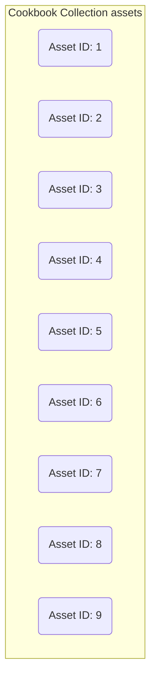
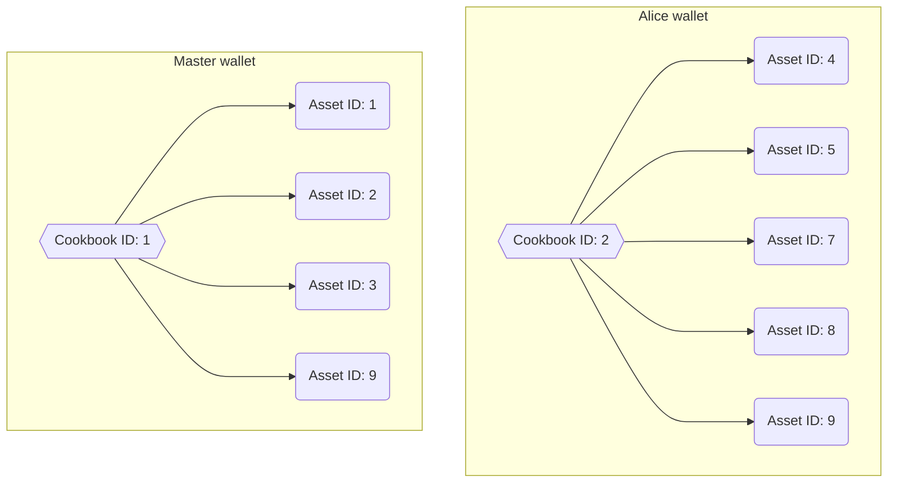

### Master retires - Token burning with related assets

_When the collaboration ended, Master decided to retire. He was an old man and he was also tired of travelling the world. This final decision resulted in him burning his cookbook.
His only wish was to leave a nice memory and a veil of mystery of his cooking prowess._

_Fortunately Master's recipes will be available for the next generations, but without the permission of Alice, his loyal student, none will be able to add the recipes into future cookbooks._

<Tabs items={['Remix', 'Hardhat' ]}> 
    <Tabs.Tab>
        Change to Master's account in your wallet search for the burn method. Set token Id to 1 and transact.
        
        We will omit this step so you can see the [final result on Singular](https://dev.singular.app/collectibles/moonbase-alpha/0xb8C5583AEC1F897bBac8C6D9f8CDAeD14444C08e).
    </Tabs.Tab>
    <Tabs.Tab>
        On your `journey.ts` script, master burns his token. We will leave it commented so you can see the [final result on Singular](https://dev.singular.app/collectibles/moonbase-alpha/0x473b8FC2483c516AadB8d365027A8C2eB8700A39) after running the script.
        ```typescript copy
        // 9. Master retires - Token burning with related assets
        // await cookbook.connect(master).burn(masterCookbookId);
        // console.log(`Burned token ${masterCookbookId}`);
        ```
        You can now run the journey:
        ```bash copy
        yarn hardhat run scripts/journey.ts --network moonbaseAlpha
        ```
        You should see the following output (except for the addresses):
        ```bash
        Running cookbook journey on moonbaseAlpha blockchain...
        Deploying contracts with the account: 0xA6cc9397d29b631b69782e5F7fB9801224C8FA90
        Deploying contracts with the account: 0x855dF0303Fec3a56c02fE35d8fb4d5e80A8c79A0
        Using Cookbook deployed at 0x473b8FC2483c516AadB8d365027A8C2eB8700A39.
        Minted token with id 1 for 0xA6cc9397d29b631b69782e5F7fB9801224C8FA90
        Added 3 assets to the collection
        Added 3 assets to the token 1
        Added 0x855dF0303Fec3a56c02fE35d8fb4d5e80A8c79A0 as a contributor
        Added 2 assets to the token 2
        Accepted asset 6 from 0xA6cc9397d29b631b69782e5F7fB9801224C8FA90
        Improved asset 6 with 7
        Added 2 assets to the token 2 and 1 to 1
        Done in 600.03s.
        ```
        <Callout type="info">
        All the code is available at [RMRK's examples repo](https://github.com/rmrk-team/rmrk-examples/tree/master/contract-examples/multiasset-cookbook) on Github.
        </Callout>
    </Tabs.Tab>
</Tabs>

The result on both Remix or Hardhat is exactly the same.


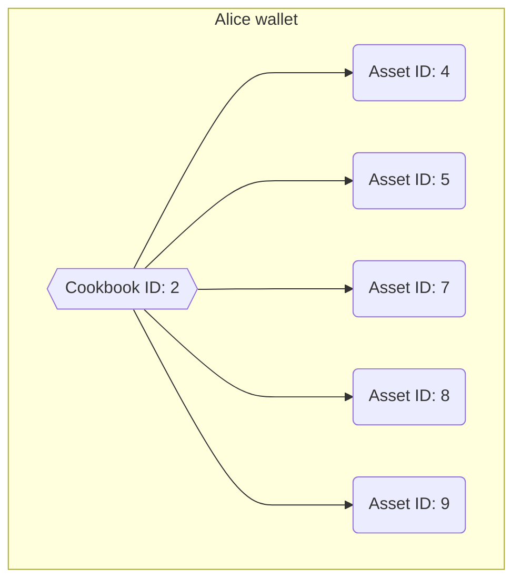

</Steps>

## User journey summary 

In this tutorial we have seen how to interact with the Multi-Asset implementation in order to:

1. **Create a collection** with tokens that support this standard
2. **Create and add assets** (resources) to a token
3. **Accept** a pending asset
4. **Replace** an active asset with another one
5. **Manage** contributors
6. **Burn** a token with all its assets bound

## Development notes

- When you add a new entry to the collection you are creating a new asset (resource) that can be used by adding it to the collection tokens, but this asset is not *unique* so it can be added to multiple different tokens.
- In this implementation, the assets cannot be unbound from a token. Once you add the asset with ID 5 to the token with ID 1 there is no way to remove it, so be careful when accepting new assets from unknown origins.
On the other hand, an asset can be "*deleted*" by replacing it with a new one, this will keep the number of active assets the same.

## Bugs, doubts and help

For clarifications, bug reporting or help please open a Github issue or write a message here:
- **Telegram**: https://t.me/rmrkimpl